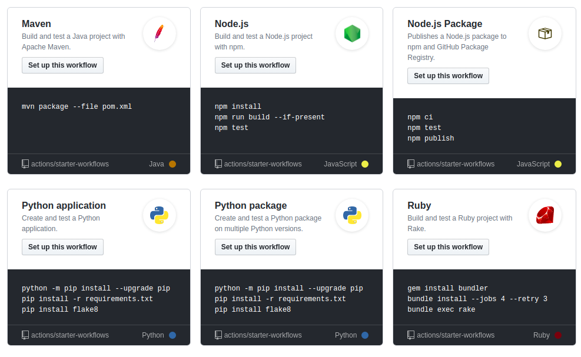
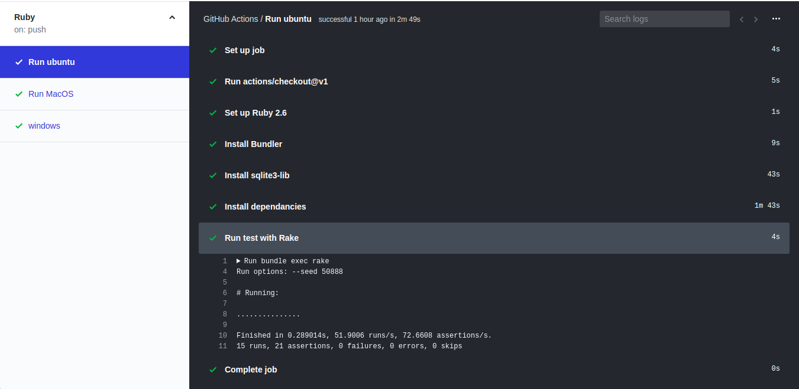

Github actions now supports CI/CD to automate how you build,test and deploy applications. With Github actions you can build, test and deploy your application on any platform including Linux,Mac Os and Windows. Actions support many languages and frameworks including Rails.

## Github Action Features 
- `Matrix build` - Test you application on multiple versions and platform
- `Live logs` - Provide rich feedback on build process
- `Automate workflows on any Event` - automate pull request,release and many events on Github
- `Integrated package and container registry` - Actions make it easier to publish and consume packages 

## Build and test a rails app 
Actions comes with suggested workflows which is appropriate for your project.



Lets have a look at the suggested Ruby workflow.
```
name: Ruby

on: [push]

jobs:
  build:

    runs-on: ubuntu-latest

    steps:
    - uses: actions/checkout@v1
    - name: Set up Ruby 2.6
      uses: actions/setup-ruby@v1
      with:
        ruby-version: 2.6.x
    - name: Build and test with Rake
      run: |
        gem install bundler
        bundle install --jobs 4 --retry 3
        bundle exec rake

``` 
The first line specify the name of the workflow. Next specify when you want to run workflow,Actions supports almost all events including `push`,`pull_request`.
You can alo run on certain branches of your project.eg
```
on:
 push:
  branches:
   -master
   -release
```
Or only on `pull_request` to `master` branch 
```
on:
 pull_request:
  branches:
   -master
```
You can also schedule workflows to run at specific UTC time using [POSIX cron syntax](https://pubs.opengroup.org/onlinepubs/9699919799/utilities/crontab.html#tag_20_25_07)
Below example trigger workflow every 30 minutes
```
on:
 schedule:
  - cron '*/30 * * * *'
```

The `runs-on` specify the operating system where workflow run. Github provides hosted runners for ubuntu,mac OS and windows.Some of the available virtual machines include `ubuntu-latest,ubuntu-18.04,windows-latest,windows-2019,macOS-latest` 

## Checkout Action 
There are several standard actions you can use in your workflow. To use the standard action, include this step.

```
- uses: actions/checkout@v1

```
Using `v1` ensures you are using the stable version of [checkout action](https://github.com/actions/checkout)
To shallow clone your repository, or copy only the latest version of your repository, set the `fetch-depth` with the with syntax, [read more](https://github.com/actions/checkout)
```
- uses: actions/checkout@v1
  with:
    fetch-depth: 1
``` 

After setting the checkout with a prefered versison of your project, you can now list the your steps with `name` and `run` command.This exaple install bundler,install dependancies from Gemfile and run test with rake.
```
    - name: Install Bundler
      run: gem install bundler
    
    - name: Install dependancies 
      run: bundle install --jobs 4 --retry 3
    - name: Run test with Rake 
      run: bundle exec rake
```

Depending on the OS you might want to install some dependancies required by your gems. For example in Ubuntu i installed this library for `sqlite3`
```
    - name: Install sqlite3-lib
      run: sudo apt-get install libsqlite3-dev
```

## Build across multiple platform 
The following `Yaml` syntax will define jobs to build and test our rails app on three platform `ubuntu`,`macOS`,`windows`.

```
name: Ruby

on: [push, pull_request]

jobs:
  ubuntu:
    name: Run ubuntu

    runs-on: ubuntu-latest

    steps:
    - uses: actions/checkout@v1
    - name: Set up Ruby 2.6
      uses: actions/setup-ruby@v1
      with:
        ruby-version: 2.6.x
    - name: Install Bundler
      run: gem install bundler
    - name: Install sqlite3-lib
      run: sudo apt-get install libsqlite3-dev
    - name: Install dependancies 
      run: bundle install --jobs 4 --retry 3
    - name: Run test with Rake 
      run: bundle exec rake

  macOS:
    name: Run MacOS
    runs-on: macos-latest
    steps:
    - uses: actions/checkout@v1
    - name: Set up Ruby 2.6
      uses: actions/setup-ruby@v1
      with:
        ruby-version: 2.6.x
    - name: Install Bundler
      run: gem update bundler
    #- name: Install sqlite3-lib
      #run: sudo apt-get install libsqlite3-dev
    - name: Install dependancies 
      run: bundle install --jobs 4 --retry 3
    - name: Run test with Rake 
      run: bundle exec rake

  windows:
    name: Run Windows
    runs-on: windows-latest
    steps:
    - uses: actions/checkout@v1
    - name: Set up Ruby 2.6
      uses: actions/setup-ruby@v1
      with:
        ruby-version: 2.6.x
    - name: Install Bundler
      run: gem install bundler
    
    - name: Install dependancies 
      run: bundle install --jobs 4 --retry 3
    - name: Run test with Rake 
      run: bundle exec rake
```

Lets have a look at the final output 



See more on the [repo](https://github.com/gathuku/zege), you may not see the the actions if you are reading before November 2019 untill it become public available.