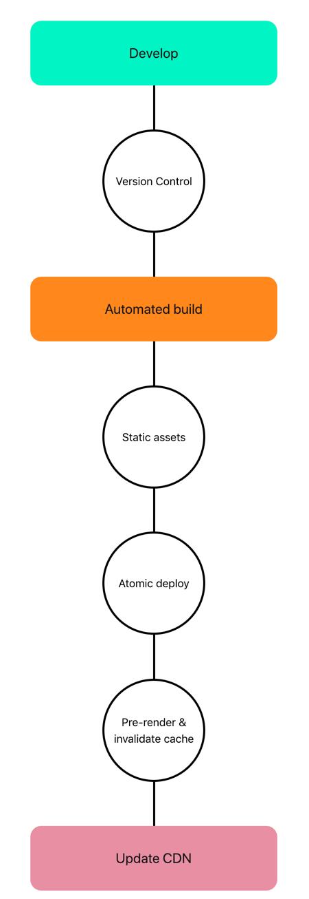

## What is JAMstack  
JAM stands for JavaScript, API & Markup.

> A modern web development architecture based on client-side JavaScript, reusable APIs, and prebuilt Markup

### JavaScript
Dynamic functionalities are handled by JavaScript. There is no restriction on which framework or library you must use

### APIs
Server side operations are abstracted into reusable APIs and accessed over HTTPS with JavaScript. These can be third party services or your custom function

### Markup
Websites are served as static HTML files. These can be generated from source files, such as Markdown, using a Static Site Generator.

## Benefits
Here are some of the benefits
1. More secure
>No need to worry about server or database vulnerabilities

2. Less Expensive
>Hosting of static files are cheap or even free

3. Faster Performance
>Serve pre-built markup and assets over a CDN

4. Better Developer experience
>Front end developers can focus on the front end, without being tied to a monolithic architecture. This usually means quicker and more focused development.

5. Scalability
>If your product suddenly goes viral and has many active users, the CDN seamlessly compensates

## JAMstack Workflow
Here's an ideal JAMstack workflow

## Getting Started
### Development
However you decide to generate your HTML assets is up to you. The three most common approaches are:
1. Handcoding
>Simple and effective method of writing HTML, it's ideal for super simple pages.

2. Static site generators
>Most JAMstack sites are powered by a static site generator. There's no enforcement on which SSG you decide to use.
eg. Gatsby,Next.js,Gridsome

### Deployment
Your built site needs to be hosted somewhere. There are great services that provides this for free and with ease.
> Netlify,Githubpages

### Dynamic Parts
JAMstack websites don't have to be static. There are great services available to help bring some dynamic data to your product.

1. Custom functions
You can also abstract your own functions into reusable APIs. For this you can use [AWS lambda](https://aws.amazon.com/lambda/features/) functions or [Netlify Functions](https://functions.netlify.com/examples/)

2. Forms
A great way to interact with your audience

3. Search
Rely on third party services to integrate a search functionality
